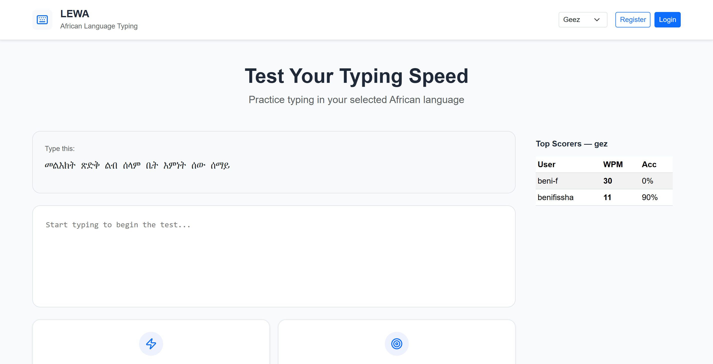
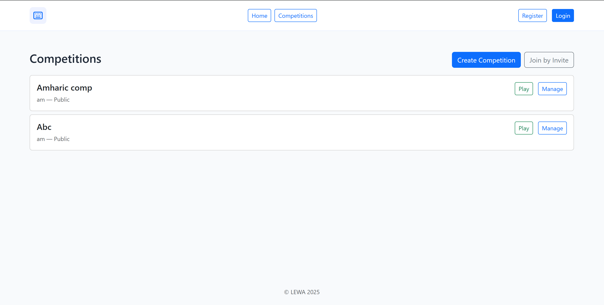
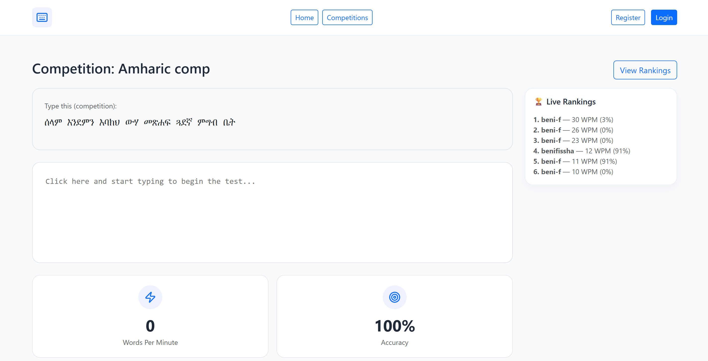

# lewa-type
A platform to learn the typing using african writing systems.

## Installation & Setup

1. **Clone the repository**

```bash
git clone https://github.com/YOUR_USERNAME/lewa-type.git
cd lewa-type
```

2. **Create a virtual environment**

```bash
python -m venv venv
source venv/bin/activate # on Windows: venv\Scripts\activate
```

3. **Install dependencies**

```bash
pip install -r requirements.txt
```

4. **Initialize Database schema then Run the Flask server**

```bash
python init_db.py
flask run
```
Main Pages
--------------------
1.  **Home**
    
    *   **Route**: /
        
    *   **Purpose**: Select language and access typing practice.
        
    *   **Access**: Public.
        
    *   **Template**: home.html
        
    *   **Features**: Language dropdown, session persistence, auth status.
        
2.  **Login**
    
    *   **Route**: /login (GET/POST)
        
    *   **Purpose**: User login with username/email and password.
        
    *   **Access**: Public (redirects if authenticated).
        
    *   **Template**: login.html
        
    *   **Features**: Auth check, JWT on success.
        
3.  **Signup**
    
    *   **Route**: /signup (GET/POST)
        
    *   **Purpose**: Create new account (username, email, password).
        
    *   **Access**: Public (redirects if authenticated).
        
    *   **Template**: signup.html
        
    *   **Features**: Uniqueness check, auto-login on success.
        
4.  **Competitions List**
    
    *   **Route**: /competitions (GET)
        
    *   **Purpose**: View available competitions.
        
    *   **Access**: Public.
        
    *   **Template**: competitions.html
        
    *   **Features**: Lists public/user-specific comps.
        
5.  **Create Competition**
    
    *   **Route**: /competitions/new (GET)
        
    *   **Purpose**: Form to create new competition.
        
    *   **Access**: Authenticated users.
        
    *   **Template**: competition\_create.html
        
    *   **Features**: Set title, language, public/private, live rankings.
        
6.  **Manage Competition**
    
    *   **Route**: /competitions//manage (GET)
        
    *   **Purpose**: Manage specific competition (invites, remove users).
        
    *   **Access**: Manager only.
        
    *   **Template**: competition\_manage.html
        
    *   **Features**: Restricted to creator.
        
7.  **Play Competition**
    
    *   **Route**: /competitions//play (GET)
        
    *   **Purpose**: Typing interface with live rankings.
        
    *   **Access**: Public for public comps; authenticated participant/manager for private.
        
    *   **Template**: competition\_play.html
        
    *   **Features**: Displays title/language, typing area.
        

API/Non-Page Routes
-------------------

*   **Logout**: /logout (POST) – Clears session/JWT.
    
*   **Save Score**: /save-score (POST) – Saves WPM/accuracy (authenticated).
    
*   **API Competitions**: /api/competitions (GET) – JSON list of accessible comps.
    
*   **Participants**: /api/competitions//participants (GET) – JSON participant list.
    
*   **Invite**: /competitions//invite (POST) – Generate invite token (manager).
    
*   **Join**: /competitions/join (POST) – Join via token (authenticated).
    
*   **Submit Score**: /competitions//submit-score (POST) – Submit comp score (participant).
    
*   **Rankings**: /competitions//rankings (GET) – JSON rankings.
    
*   **Live Rankings**: /competitions//live (GET) – SSE stream of updates.
    
*   **Remove User**: /competitions//remove-user (POST) – Remove participant (manager).
    
*   **Delete Comp**: /competitions//delete (POST) – Delete competition (manager).
    
*   **Global Rankings**: /rankings (GET) – JSON top 10 scores by language.


# Preview




